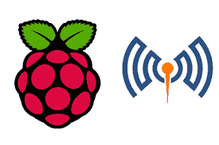
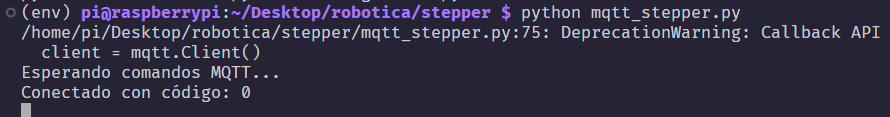
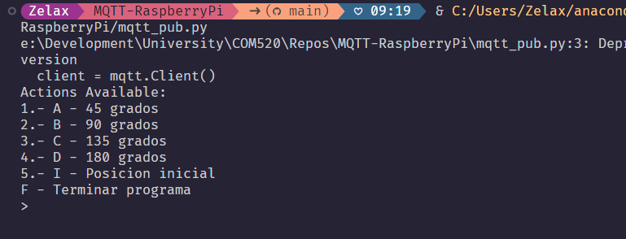

<a name="readme-top"></a>
![Maintained][Maintained-shield]
![Forks][Forks-shield]
![Pull Request][PullRequest-shield]
![Pull Request Closed][PullRequestclosed-shield]

<!-- PROJECT LOGO -->
<br />
<div align="center">
  <a href="https://github.com/mickychog/MQTT-RaspberryPi">
    
  </a>

<h3 align="center">MQTT Communication</h3>

  <p align="center">
    MQTT project to handle publish/subscriber messages
    <br />
    <a href="https://github.com/mickychog/MQTT-RaspberryPi/blob/main/README.md"><strong>Explore the docs »</strong></a>
    <br />
    <br />
    ·
    <a href="https://github.com/mickychog/MQTT-RaspberryPi/issues">Report Bug</a>
    ·
    <a href="https://github.com/mickychog/MQTT-RaspberryPi/issues">Request Feature</a>
  </p>
</div>

<!-- TABLE OF CONTENTS -->
<details>
  <summary>Tabla de contenido</summary>
  <ol>
    <li>
      <a href="#acerca-del-proyeto">Acerca Del Proyeto</a>
    </li>
    <li><a href="#hardware-necesario">Hardware Necesario</a></li>
    <li><a href="#configuracion-de-entorno">Configuracion de entorno</a></li>
    <li>
      <a href="#descarga">Descarga</a>
    </li>
    <li><a href="#instalacion">Instalacion</a></li>
    <li><a href="#configuracion-del-proyecto">Configuracion del proyecto</li>
    <li><a href="#tech-stack">Tech Stack</a></li>
  </ol>
</details>

## Acerca Del Proyeto

`MQTT Communication` es un proyecto basico Open Source que permite crear la comunicacion entre un host y cualquier otro host mediante el protocolo MQTT permitiendo la comunicacion por envio de mensajes.

Este es un inicio basico para trabajar con Python usando un publicador y un suscriptor

- EL protocolo MQTT permite crear un topico por el cual se comunican mediante el mismo topico, esto para enviar mensajes en el caso del proyecto es el `"ALSW/ORDEN"`
- El `Payload` resulta tan ligero que es posible realizar proyectos de domotica

## Hardware Necesario

> [!IMPORTANT]
> El `Hardware` necesario para este proyecto dependera de la implementacion del usurio, en este caso el proyecto usara un motor paso a paso

- Raspberry pi
- Motor paso a paso
- Motor Driver L298N
- Jumpers

## Configuracion de entorno previa

Considerando que el proyecto hace uso de los pines `GPIO` es importante instalar y configurar las dependencias relacionadas a esta para tenerlas activas en todo momento

```
$ sudo apt update
$ sudo apt install -y pigpio pthon3-pigpio
$ sudo systemctl enable pigpiod
$ sudo systemctl start pigpiod
```

## Descarga

Al clonar el repositorio tener en cuenta los archivos y sus respectivas funciones, siendo el `mqtt_pub.py` el ejecutable para cualquier entorno con _Python_ desde donde se quiera enviar los mensajes al servidor MQTT y `mqtt_sub.py` el que sera instalado en el _Raspberry_ para ejecutar las acciones hechas con los pines `GPIO`

El proyecto ejecutado en el Raspberry utiliza las dependencias definidas en el archivo `requirements.txt`, en esta seccion crearemos un entorno virtual `venv` para ejecutar nuestro proyecto en python e instalaremos las dependencias

```
$ git clone https://github.com/mickychog/MQTT-RaspberryPi.git
$ cd MQTT-RASPBERRY
$ python -m venv env
$ source env/bin/activate
$ pip install -r requirements.txt
```

## Instalacion

El proyecto no requiere de una instalacion mas alla de la ejecucion del script de Python, en este caso el archivo `mqtt_sub` debera ser ejecutado en el `Raspberry` y el archivo `mqtt_pub` en cualquier otro host que hara la comunicacion

```
$ sudo python mqtt_sub.py
```

Y el otro archivo dependera del entorno de ejecucion sin embargo el resultado sera el mismo al solo tener que ejecutar el script

## Configuracion del proyecto

La base del proyecto es para mover un motor paso a paso con comandos enviados desde el host publicador sin embargo al estar usando los pines `GPIO` esto puede ser aplicado a cualquier implementacion de robotica

## Ejemplo de ejecucion

Primero debemos ejecutar el `Subscriber` que en nuestro caso va a ser el codigo a ejecutar en el `Raspberry` para esperar los mensajes que llegaran del host `Publisher` para el cual debemos iniciar el script

```
python qtt_stepper.py
```

Y tendremos un respuesta como esta:



Y en el host publicador sera esto:



## Tech Stack

[](https://www.python.org/)
[]()

[Maintained-shield]: https://img.shields.io/badge/Maintained%3F-yes-green.svg
[Forks-shield]: https://img.shields.io/github/forks/mickychog/MQTT-RaspberryPi.svg
[PullRequest-shield]: https://img.shields.io/github/issues-pr/mickychog/MQTT-RaspberryPi.svg
[PullRequestclosed-shield]: https://img.shields.io/github/issues-pr-closed/mickychog/MQTT-RaspberryPi.svg
[Java]: https://img.shields.io/badge/Java-ED8B00?style=for-the-badge&logo=openjdk&logoColor=white
[Java-url]: https://www.java.com/es/
[IntelliJ]: https://img.shields.io/badge/Intellij%20Idea-000?logo=intellij-idea&style=for-the-badge
[IntelliJ-url]: https://www.jetbrains.com/idea/
[Git]: https://img.shields.io/badge/GIT-E44C30?style=for-the-badge&logo=git&logoColor=white
[Git-url]: https://git-scm.com/
[Powershell]: https://img.shields.io/badge/powershell-5391FE?style=for-the-badge&logo=powershell&logoColor=white
[Powershell-url]: https://www.microsoft.com/store/productId/9MZ1SNWT0N5D?ocid=pdpshare
[Github]: https://img.shields.io/badge/GitHub-100000?style=for-the-badge&logo=github&logoColor=white
[Github-url]: https://github.com/
